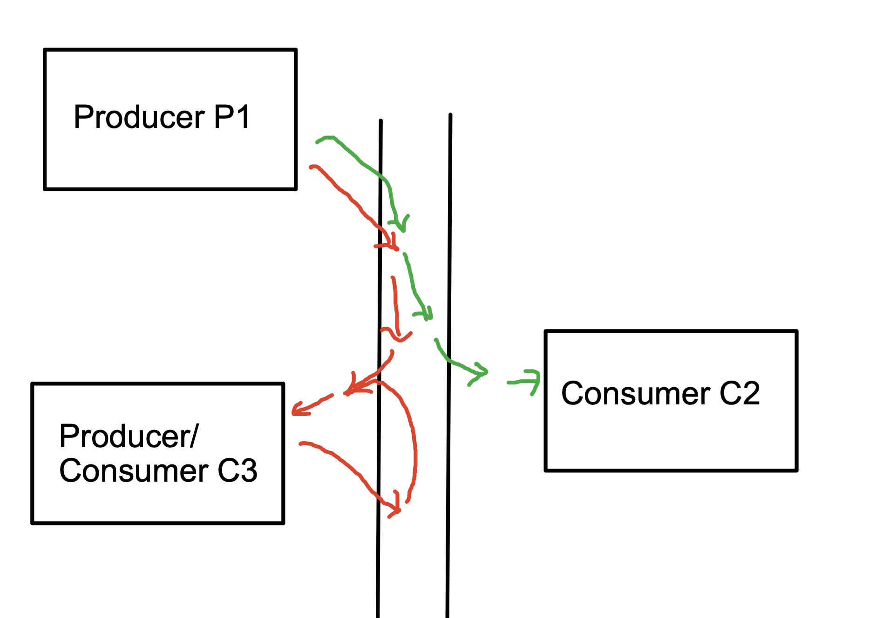
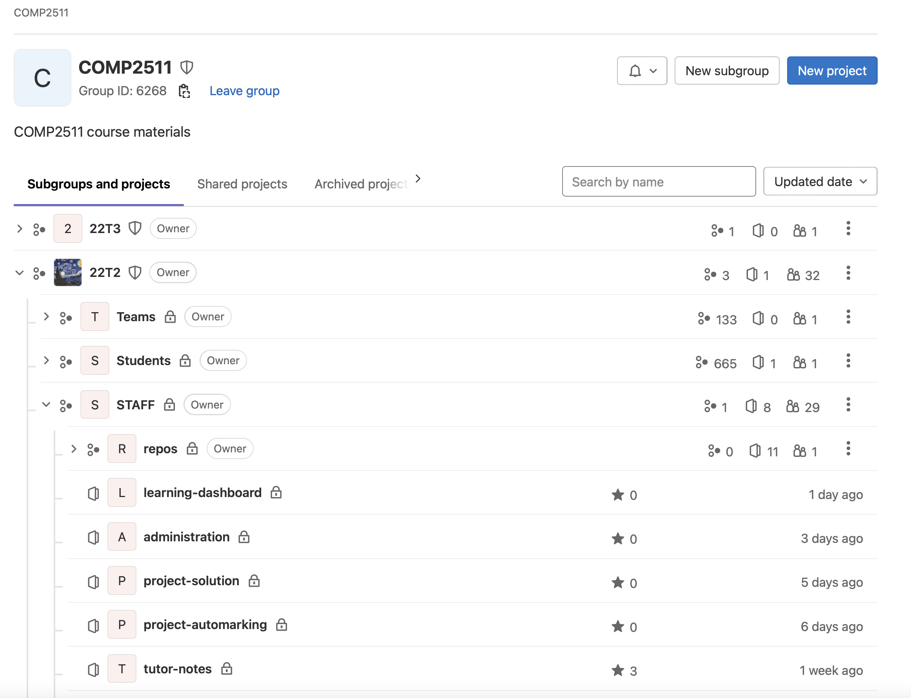

# COMP2511 22T2 Final Exam

Please read the [COMP2511 Exam Information Page](https://webcms3.cse.unsw.edu.au/COMP2511/22T2/resources/75511) page for all information on the final exam.

DO NOT answer all questions.

The exam consists of three sections:
* Short Answer (25 marks)
    * Answer all of Q1 - Q6 core questions (19 marks)
    * Answer **two** out of **six** choice questions Q7 - Q12 (6 marks)
    * If you answer more than two out of the six choice questions we will only mark the first two.
* Extended Answer (10 marks)
    * Answer Question 13 (10 marks)
* Design & Programming (65 marks)
    * Question 14
        * Answer all of core parts a, b, c, d (26 marks)
        * Answer **one** out of **two** choice parts e or f (9 marks)
        * If you answer more than one choice part we will only mark the first one.
    * Question 15
        * Answer all of core parts a, b, c, d, e (30 marks)
        * This question does not have any choice parts.

## Getting Setup

Your personalised exam repo can be found here:

REMEMBER to replace the zID below with your own.

`https://gitlab.cse.unsw.edu.au/COMP2511/22T2/students/z5555555/exam`

To submit your work, push to the `master` branch of your repository. All work must be pushed before the deadline.

## Section 1: Short Answer (25 marks)

### Question One (4 marks)

In each of the following code snippets,

<ol type="i">
    <li>Identify the logic error present (1 mark); and
    <li>Write a failing assertion that would catch the logic error as part of a unit test (e.g. <code>assertEquals(4, f(2))</code>) (1 mark)</li>
</ol>

Write your answers inside `q1.txt`.

#### Part A (2 marks)

```java
@Override
public boolean equals(Object obj) {
    if (this == obj) return true;
    if (obj == null) return false;
    if (!(obj instanceof Article)) return false;

    Article other = (Article) obj;
    return this.title.equals(other.title) && this.views.equals(other.views);
}
```

#### Part B (2 marks)

```java
public List<Integer> withoutOddNumbers(List<Integer> numbers) {
    for (Integer number : numbers) {
        if (number % 2 != 0) {
            numbers.remove(number);
        }
    }

    return new ArrayList<Integer>(numbers);
}
```

### Question Two (3 marks)

#### Part A (1 mark)

Select one or more of the following correct answers:

The dependency inversion principle encourages programming to ____________

<ol type="a">
    <li>An implementation, not an interface</li>
    <li>An interface, not an implementation</li>
    <li>Abstractions, not concretions</li>
    <li>Concretions, not abstractions</li>
    <li>A black box</li>
    <li>A white box</li>
</ol>

Write your answer inside `q2.txt`.

#### Part B (2 marks)

Consider the `Angle` class versus the `MathsHelper` class from the Blackout assignment, provided in [Angle.java](figures/q2/Angle.java) and [MathsHelper.java](figures/q2/MathsHelper.java).

Which class do you think has better **cohesion**? Justify your answer.

Write your answer inside `q2.txt`.

### Question Three (4 marks)

In 22T3 COMP2511 is contemplating moving to Jira for students to manage their projects. There are three different types of Jira boards that can be used: Scrum, Kanban and Bug Tracking. All boards have the same flow of work, and allow for features including support for issue tracking and customisation of project-specific features. However, some elements may vary for each type of board - Scrum boards take two week sprints whereas Kanban has a series of epics that are progressed through, and bug tracking projects only have a single backlog. Once a project is created as Scrum, Kanban or Bug Tracking it cannot change its type.

What Design Pattern could be used to model this? In answering, justify your choice by describing how the above scenario relates to the **key characteristics** of your chosen Design Pattern. 

Write your answer inside `q3.txt`.

### Question Four (2 marks)

Webster is waiting for tickets to be released to the next Sydney Swans game. He has setup notifications on his phone that will alert him when the tickets open, and he is also checking his phone regularly since there are a limited number of tickets and he needs to be one of the first ones to book to save a place.

Which implementation of the Observer Pattern is present in the above scenario, **push** or **pull**? Justify your answer.

Write your answer inside `q4.txt`.

### Question Five (3 marks)

Identify the code smells present in the following pieces of code, and explain whether you think this is indicative of an underlying design problem, if so what the problem is, or alternatively if you think you don't have enough information to tell.

Write your answers inside `q5.txt`.

#### Part A (2 marks)

Scenario: A satellite simulation where various satellites are orbiting the Jovian ring.

```java
private List<Satellite> standardSatellites;
private List<Satellite> quantumSatellites;

/**
 **  Run the simulation for a single minute
 **/
public void simulate() {
    // Update Position of Satellites
    for (Satellite s : standardSatellites) {
        s.setPosition(s.getPosition() + 3000 / s.getHeight());
    }

    for (Satellite s : quantumSatellites) {
        s.setPosition(s.getPosition() + 2000 / s.getHeight());
    }
    // ... so on
}
```

#### Part B (1 mark)

```java
public class ConsumeService {
    // ...

    public void startConsumeService(Config config, Consumer consumer, Logger logger, 
                                    Tracer tracer, Metrics metrics, String[] topics, 
                                    boolean willTimeout, int timeout) {
        // ...
    }
}
```

### Question Six (3 marks)

During the project, a student on the forum asked the following question:

> Are we allowed to modify the `Position` class given to us?

Tina answered the following:

> Yes, so long as you don't break the preconditions and postconditions of that class - we will rely on these for automarking.

With reference to the Liskov Substitution Principle, explain what is meant by "breaking the preconditions and postconditions". Provide one example (either breaking the preconditions or postconditions) of this with reference to the `Position` class, provided for you in [Position.java](figures/q6/Position.java) and explain how it would affect the automarking in this scenario.

Write your answer inside `q6.txt`.

| You must answer *two* (2) out of the following *six* (6) choice questions. |
| ----------------------------------------------------------------------- |

### Question Seven (3 marks)

Consider the following lambda function which checks if a number is prime. The type signature has been redacted.

```java
[redacted] isPrime = n -> {
    for (int i = 0; i < Math.sqrt(n); i++) {
        if (n % i == 0) return false;
    }

    return true;
};
```

Which of the following answers could be correct? Out of these possible answers, explain which one is the most semantically correct.

```java
a. Function
b. Function<Integer, Boolean>
c. Consumer
d. Consumer<Integer>
e. Predicate
f. Predicate<Integer>
g. Supplier
h. Supplier<Boolean>
```

Write your answer inside `q7.txt`. Leave `q7.txt` blank if you are not attempting this question.

### Question Eight (3 marks)

During the project, Sienna and her group came up with the following testing plan:

> To make sure our code is 100% correct, we will write unit tests for everything at the class level, and controller tests for everything as well at the system level.

Here is an example of their test list for implementing battles:

<table>
<tr>
<th>
Unit Tests
</th>
<th>
Controller / System Tests
</th>
<tr>
<td>

- Test the player wins when battling a mercenary
- Test the player loses when battling a mercenary
- Test the player wins when battling a mercenary while invincible
- Test the player wins when battling a zombie
- Test the player loses when battling a zombie
- Test the player wins when battling a zombie while invincible
- Test the player wins when battling a spider
- Test the player loses when battling a spider
- Test the player wins when battling a spider while invincible

</td>
<td>

- Test the player wins when battling a mercenary
- Test the player loses when battling a mercenary
- Test the player wins when battling a mercenary while invincible
- Test the player wins when battling a zombie
- Test the player loses when battling a zombie
- Test the player wins when battling a zombie while invincible
- Test the player wins when battling a spider
- Test the player loses when battling a spider
- Test the player wins when battling a spider while invincible

</td>
</tr>
</table>

Explain why this is poor test design, and a possible alternative approach to testing.

Write your answer inside `q8.txt`. Leave `q8.txt` blank if you are not attempting this question.

| :information_source: Continue to Section 2 if you've answered two out of two choice questions already!  |
| ----------------------------------------------------------------------------------- |

### Question Nine (3 marks)

In a few days, Nick is going to run the automarker and download everyone's exam repositories. The `collect` script contains a simple loop which downloads each student's repo, as follows. You can refer to the following pseudocode:

```sh
for student in students
    print "==== Processing " + student + "===="
    git clone path + "/" + student + "/exam.git" student
    # more stuff
done
```

However, when multiple `git clone` operations are run in close proximity by the same machine (usually around 10) Gitlab implements a protection strategy which blocks further `git clone`s from being performed by that machine, in order to prevent someone launching a Denial of Service attack. When downloading repositories, however, this means that some `git clone` operations fail. When the exam automarking is run, it is only run on the present folders and around 30 students won't receive their exam marks because of this error.

What was the flaw (or flaws) in this design? Explain two measures that could have been put in place to mitigate this from happening.

Write your answer inside `q9.txt`. Leave `q9.txt` blank if you are not attempting this question.

### Question Ten (3 marks)

> *All software development is maintenance.*

With reference to your project, in a paragraph or so, discuss the accuracy of the statement above.

Write your answer inside `q10.txt`. Leave `q10.txt` blank if you are not attempting this question.

### Question Eleven (3 marks)

Liam is constructing a painting application, and has created a UML diagram which can be found in [Q11-Quaint.pdf](figures/Q11-Quaint.pdf) to model the domain. 

<ol type="a">
    <li>Identify the Design Patterns used in Liam's implementation. (1 mark)
    <li>Pick <b>one</b> of the design patterns and describe the how the implementation relates to the key characteristics of the design pattern. (2 marks)</li>
</ol>

Write your answer inside `q11.txt`. Leave `q11.txt` blank if you are not attempting this question.

#### Question Twelve (3 marks)

In the asynchronous implementation of event-driven programming, Consumers and Producers communicate by reading from and writing to a shared channel. Different types of events can flow through the channel, and Consumers and Producers can wear multiple hats - a Consumer can also act as a Producer and vice-versa. In this case, when the entity consumes an event it immediately produces another event. Consumers "subscribe" to events of a particular colour which are created by Producers.

Consider the following scenario where a Consumer C3, which consumes red events also acts as a Producer of red events.



Explain the problem caused by this design.

Write your answer inside `q12.txt`. Leave `q12.txt` blank if you are not attempting this question.

| 🔗 Now is a good time to push your work to GitLab. |
| ------- |

## Section 2: Extended Answer (10 marks)

### Question Thirteen (10 marks)

Many online newspapers such as the *Sydney Morning Herald* provide a special type of article called a "live article", which uses the benefits of real-time updating in the digital age to consistently provide new stories to readers throughout the day, each of these stories is called a **post** (see below).

<hr />


<hr />

In this question, you will be designing, **but not implementing** a system with the following functional requirements:

* A new live article can be created, storing the time it was first created;
* A new **post** can be made on the article, which includes the content, post title and a time the post was created;
* An existing post can have its content updated;
* An existing post can be deleted
* A comment can be made on a post

Model the domain for the above requirements to form the basis of a potential software solution. Your answer should include:

* Interfaces, if applicable
* Class Signatures, including inheritance relationships where appropriate
* Method Signatures
* Key Fields and relationships, including aggregations, compositions and cardinalities between entities (written as comments)

**You do not need to implement any of these classes/methods, you are simply providing the prototypes / stubs**. Any design decisions that you feel need justifying you can do so as a comment / JavaDoc in the respective file.

An interface for the entire system has been provided to you in `src/main/java/q13/LiveArticleSystem.java`. You can modify these method prototypes if you like, though you shouldn't need to.

There is a *lot* of undefined behaviour about this system, which is intentional. You can make as many assumptions as you need, so long as they don't reduce the scope of the specification. 

You will be assessed on:
* Modelling of Entities (4 marks)
* Aggregations, Compositions and Cardinalities (3 marks)
* Modelling of Functionality (3 marks)

| ⌛ Try to spend around 10 minutes on this question to give yourself plenty of time for the Design & Programming section. |
| -------- |

| 🔗 Now is a good time to push your work to GitLab. |
| ------- |

## Section 3: Design & Programming (65 marks)

### Question Fourteen (35 marks)

In Lab 05: SSO, we looked at a system that handled *Authentication*. In this question, we will be dealing with *Authorisation* in the context of a system that you have been working with - Gitlab.

In Gitlab, there are two types of "nodes" in a structural tree of permissions and access - **groups** and **projects**. 

* **Groups** are nodes that can contain projects, or other subgroups;
* **Projects** are nodes that do not have any subgroups or subprojects, and act as a code repository (like this exam repo)



In the above example, the tree consists of the COMP2511 group which contains the 22T2 group, which contains STAFF group which contains the tutor-notes project, other projects and another group called repos.

At each level, a user can have one of four different types of **permissions**:
- Owner
- Maintainer
- Developer
- Reporter

For the purposes of this question, the only actions that will require permissions are:
- Creating a project, which requires Developer permissions
- Creating a subgroup, which requires Maintainer permissions
- Changing the permissions of another member in the group, which requires Owner Permissions 

Inside `src/q14/gitlab` we have implemented a very basic system that addresses the above requirements. In this question you will be required to **analyse the existing code**, **make notes of design smells and refactor the code**, and **adapt the code to an evolution in the requirements**.

There are a series of regression tests that currently pass on the code in `RegressionsTests` within `GitlabTest.java`.

#### a) Code Analysis (5 marks)

Look at the code inside the `gitlab` package and in `q14.txt` answer the following questions:
<ol type="i">
    <li>Explain what Design Pattern is being used to represent the system, and how the domain relates to the key characteristics of the pattern. (2 marks)</li>
    <li>Identify what you think is the main design problem present in the existing code, including what smells are indicating the problem. (2 marks)</li>
    <li>Which of the following design smells is also present in the code? (1 mark)
    <ul>
        <li>Divergent Change</li>
        <li>Inappropriate Intimacy</li>
        <li>Refused Bequest</li>
        <li>Message Chains</li>
    </ul>
</ol>

#### b) Refactoring a Method (3 marks)

Refactor the following method inside `GitlabGroup` to use streams:

```java
public List<String> getUsersOfPermissionLevel(PermissionsLevel level) {
    Set<User> membersSet = members.keySet();
    List<String> names = new ArrayList<String>();

    for (User member : membersSet) {
        if (members.get(member).equals(level)) {
            names.add(member.getName());
        }
    }

    return names;
}
```

In your refactoring, you will need to keep the regression tests passing, which are provided in `RegressionsTests` within `GitlabTest.java`.

#### c) Refactoring the Design (9 marks)

Based on your notes on Design Smells from Part A, refactor the design of the system accordingly.

You can make any changes as you like, so long as you keep the regression tests passing, which are provided in `RegressionsTests` within `GitlabTest.java`.

Any notes you wish to make regarding your refactoring can go inside `q14.txt`.

The mark breakdown for this question is as follows:
- Maintaining Correctness (1 mark)
- Refactoring (8 marks)

#### d) Filtering Authorisation (9 marks)

Currently, there is a major flaw in our implementation - the system does not **filter** permissions from groups to all their subgroups and projects.

For example, if Claire is the owner of the COMP2511 group, then she is also the owner of the 22T2 group, the STAFF group and the tutor-notes project and has the same Owner permissions on those groups as if she was a direct owner of those respective nodes.

Similarly, if a user tries to give permissions to another user on a group which, by filtering authorisation they **already** have permissions on, a `GitlabAuthorisationException` should be thrown.

In code, here is an illustration of the above description:

```java
User user = new User("Claire");
User user2 = new User("Eddie");

// Create a group
GitlabPermissionsNode group = new GitlabGroup("COMP2511", user);
// Create a subgroup
GitlabPermissionsNode group2 = assertDoesNotThrow(() -> group.createSubgroup("22T2", user)); 
// Give dev access to Eddie on the COMP2511 group
assertDoesNotThrow(() -> group.updateUserPermissions(user2, PermissionsLevel.DEVELOPER, user)); 
// Check that Eddie also has dev access on the 22T2 group
assertEquals(PermissionsLevel.DEVELOPER, group2.getUserPermissions(user2));
// Try to give Eddie reporter access on the 22T2 group, but he is already a developer of COMP2511
// so an authorisation error is thrown
assertThrows(GitlabAuthorisationException.class, 
    () -> group2.updateUserPermissions(user2, PermissionsLevel.REPORTER, user));
```

Implement the 'filtering' of authorisation. A basic test has been provided to you in `PartDFilteringAuthorisationTests` within `GitlabTest.java`. We will run further tests on this question to assess the correctness of your solution.

The mark breakdown for this question is as follows:
* Correctness (5 marks)
* Design (4 marks)

Any notes you wish to make regarding your design can go inside `q14.txt`.

| You need to complete *one* (1) out of the following *two* (2) choice parts of this question. |
| --- | 

#### e) Factory Pattern (9 marks)

Inside `GitlabFactory.java`, implement the following method:

```java
public static GitlabPermissionsNode gitlabFromJson(String jsonString)
``` 

The `gitlabFromJson` method should take in a string of the following format:

```javascript
{
    "type": "group",
    "name": "COMP2511",
    "subgroups": [
        {
            "type": "group",
            "name": "22T2",
            "subgroups": [
                {
                    "type": "project",
                    "name": "dungeonmania"
                }
            ]
        },
        {
            "type": "project",
            "name": "blackout"
        }
    ]
}
```

and produce a `GitlabPermissionsNode` with the corresponding structure. You do not need to handle any processing of group/project members in this part of the question.

A basic test has been provided to you in `PartEFactoryTests`  within `GitlabTest.java`. We will run further tests on this question to assess the correctness of your solution.

Any notes you wish to make regarding your design can go inside `q14.txt`.

The mark breakdown for this question is as follows:
* Correctness (5 marks)
* Design (4 marks)

| :information_source: Continue to Question Fifteen if you have already completed Part E! |
| --- | 

#### f) Singleton Pattern (9 marks)

All projects in Gitlab run their pipelines on a single machine, which is why the runner gets very slow around project and assignment deadlines. 

Currently, the `runPipeline` method inside `GitlabProject`, which takes in an runnable "process" creates a new instance of the runner and runs the job.

```java
public void runPipeline(Runnable job) {
    GitlabRunner runner = new GitlabRunner();
    runner.run(job);
}
```

Refactor the code to use the **Singleton Pattern** so that only one instance of the `GitlabRunner` exists and only one job is able to run at a time (i.e. only one `run` call can be made at a time).

A basic test has been provided to you in `PartFSingletonTests` within `GitlabTest.java`. We will run further tests on this question to assess the correctness of your solution.

Any notes you wish to make regarding your design can go inside `q14.txt`.

The mark breakdown for this question is as follows:
* Correctness (5 marks)
* Design (4 marks)

| 🔗 Now is a good time to push your work to GitLab. |
| ------- |

### Question Fifteen (30 marks)

| 🔍 You may find parts of this question challenging. Take some time to conceptually understand the question, and reread it a couple of times if you need to. |
| ------- |

In this question, you will be implementing Java classes that can be used as a testing framework. Your solution should make use of Design Patterns and constructs from the functional paradigm in a similar fashion to Lab 08: JQL.

The inspiration for this question is derived from [the JavaScript testing framework Jest](https://jestjs.io/docs/api), though no knowledge of Jest or JavaScript is required to complete this question. 

You will be implementing a class `Expect` which takes in a reference object of type `E` in its construction. You will be able to use this class to create 'expressions' comparing the reference object to other objects, such as equality, less than, or greater than or equal to.

Once the expression is constructed, you will be able to "evaluate" the expression. This will result in either:

* `ExpectationFailedException` to be thrown, which is a `RuntimeException` which we have implemented for you; or
* The expectation will pass, no exception is raised and nothing else will happen.

Here is a simple example of an expectation that passes:

```java
Expect<String> e = new Expect<String>("hello"); // Construct the base expression
Expect<String> e2 = e.toEqual("hello"); // Construct the expression "hello" == "hello"
e2.evaluate() // The expression is true, no exception raised, nothing happens
```

Here is a simple example of an expectation that fails:

```java
Expect<String> e = new Expect<String>("hello"); // Construct the base expression
Expect<String> e2 = e.toEqual("world"); // Construct the expression "hello" == "world"
e2.evaluate() // The expression is false, a ExpectationFailedException is raised
```

#### a) Basic Testing Operations (7 marks)

Inside `q15/Expect.java`, implement the following methods:

##### Constructor

```java
public Expect(E obj)
```

Creates a new `Expect` object and initialises values.

##### `toEqual`

```java
public Expect<E> toEqual(E other)
```

Returns a new `Expect` object with an expression testing whether the reference object is equal to the provided object.

This method does not raise any exceptions.

Example Usage:

```java
Expect<String> e = new Expect<String>("hello"); // Construct the base expression
Expect<String> e2 = e.toEqual("hello"); // Construct the expression "hello" == "hello"
```

##### `lessThan`

```java
public<T extends Comparable<E>> Expect<E>
    lessThan(T other)
```

Returns a new `Expect` object with an expression testing whether the reference object is less than to the provided object.

This method does not raise any exceptions.

Example Usage:

```java
Expect<Integer> e = new Expect<Integer>(60); // Construct the base expression
Expect<Integer> e2 = e.lessThan(50); // Construct the expression 60 < 50
```

##### `greaterThanOrEqualTo`

```java
public<T extends Comparable<E>> Expect<E> 
    greaterThanOrEqualTo(T other)
```

Returns a new `Expect` object with an expression testing whether the reference object is greater than or equal to the provided object.

This method does not raise any exceptions.

Example Usage:

```java
Expect<Integer> e = new Expect<Integer>(60); // Construct the base expression
Expect<Integer> e2 = e.greaterThanOrEqualTo(50); // Construct the expression 60 >= 50
```

##### `evaluate`

```java
public void evaluate()
```

Evaluates an `Expect` expression.

If the expression that is being evaluated fails, an `ExpectationFailedException` is thrown. The exception message string is up to you to define.

Example Usages:

```java
Expect<Integer> e = new Expect<Integer>(50); // Construct the base expression
Expect<Integer> e2 = e.lessThan(60); // Construct the expression 50 < 60
e2.evaluate() // The expression is true, no exception raised, nothing happens
```

```java
Expect<Integer> e3 = new Expect<Integer>(50); // Construct the base expression
Expect<Integer> e4 = e.greaterThanOrEqualTo(60); // Construct the expression 50 >= 60
e4.evaluate() // The expression is false, a ExpectationFailedException is raised
```

When `evaluate` is called on a base object with no constructed expression, nothing happens, i.e:

```java
Expect<Integer> e = new Expect<Integer>(1);
e.evaluate(); // Nothing happens
```

##### Other Notes

* The behaviour of "chaining" multiple basic operations together such as `toEqual`, `lessThan` or `greaterThanOrEqualTo` is undefined, and you don't have to worry about:

```java
Expect<Integer> e = new Expect<Integer>(1);
Expect<Integer> e2 = e.toEqual(1).lessThan(2).greaterThanOrEqualTo(3); // undefined
```

* **HINT**: The logic of each type of expression should be handled in the `evaluate` method.

##### Marking

A basic test for each of the above methods has been provided in `PartABasicOperationsTests` within `ExpectTest.java`. We will run further tests on this question to assess the correctness of your solution.

Any notes you wish to make regarding your design can go inside `q15.txt`.

The mark breakdown for this question is as follows:
* Correctness (4 marks)
* Design (3 marks)

#### b) Decoration Operations (6 marks)

In addition to "base-level" operations, decoration operations can be performed as well.

##### `not`

```java
public Expect<E> not()
```

Negates the decorated expectation. For example, when evaluated a `toEqual` would then become a "to not equal".

```java
Expect<String> e = new Expect<String>("hello");
e.toEqual("world").not().evaluate(); // Expectation is true, no exception is raised
```

##### `skip`

```java
public Expect<E> skip()
```

Skips all of the preceding operations, when evaluated nothing is run.

```java
Expect<String> e = new Expect<String>("hello");
e.toEqual("world").skip().evaluate(); // Expectation is skipped, no exception is raised
```

##### Other Notes

* `not` and can be applied multiple times, for example:

```java
Expect<String> e = new Expect<String>("hello");
Expect<String> e2 = e.toEqual("world").not().not().not();
e2.evaluate(); // Expectation is true, no exception is raised

Expect<String> e3 = new Expect<String>("hello");
Expect<String> e4 = e.toEqual("world").not().not().skip().skip();
e4.evaluate(); // Expectation is skipped, no exception is raised
```

* No operations can be performed after a `skip`, e.g. `e.skip().toEqual("today")`, `e.skip().skip()`, `e.skip().not()` are all undefined
* A not operator cannot be the first expression, i.e. `e.not()` is undefined.

##### Marking

A basic test for each of the above methods has been provided within `ExpectTests/PartBDecorationOperationsTests`. We will run further tests on this question to assess the correctness of your solution.

Any notes you wish to make regarding your design can go inside `q15.txt`.

The mark breakdown for this question is as follows:
* Correctness (3 marks)
* Design (3 marks)

#### c) Runnable Testing Operations (6 marks)

As well as basic functionality, good test frameworks provide the ability to assert the result of calls to runnable pieces of code. 

The class inside `ExpectRunnable.java` has the following prototype:

```java
class ExpectRunnable<E extends Runnable> extends Expect<E> 
```

A `Runnable` is simply a lambda function `() -> ...` which takes in no arguments and returns nothing.

This type of expectation will wrap around a lambda and allow us to make assertions on the result of executing that lambda.

Inside `ExpectRunnable`, add and complete the following methods:

```java
private ExpectRunnable() 
```

Private constructor, no arguments.

```java
public ExpectRunnable(E exec)
```

Public constructor, one argument - the runnable to be wrapped.

```java
public<X extends Exception> ExpectRunnable<E> toThrow(Class<X> clz)
```

Takes in an object of type class, which is the type of exception that is expected to be thrown.

On evaluation, raises an `ExpectationFailedException` if:
* No exception is thrown by the wrapped runnable
* An exception is thrown by the wrapped runnable, but it is of a different class type to the one provided.

For example:

```java
ExpectRunnable<Runnable> exec = new ExpectRunnable<Runnable>(() -> {
    throw new RuntimeException("hello");
});

exec.toThrow(RuntimeException.class).evaluate();
```

You can think of this similarly to `assertThrows` in the JUnit framework.

```java
public void execute() throws Throwable
```

Executes the inner runnable, throwing any exceptions.

A basic test for each of the above methods has been provided within `ExpectTests/PartCRunnableTests`. We will run further tests on this question to assess the correctness of your solution.

Any notes you wish to make regarding your design can go inside `q15.txt`.

The mark breakdown for this question is as follows:
* Correctness (3 marks)
* Design (3 marks)

#### d) Parameterised Testing (5 marks)

| ⚠️ You may find this part of the question particularly challenging. |
| --- | 

Parameterised testing is a type of testing that allows you to improve the quality of your test code by abstracting away values and *parameterising* them into variables. 

In this part of the question, we will be writing an iterator that allows a user to parameterise tests.

The class inside `ExpectParameterised.java` has the following prototype:

```java
class ExpectParameterised<T, C extends Consumer<T>, L extends List<T>> 
implements Iterable<Runnable>
```

The class has the following constructor:

```java
public ExpectParameterised(C consumer, L parameters)
```

- `C consumer`, `C extends Consumer<T>` is an runnable function that takes in a value (the parameterised object) and returns nothing
- `L parameters`, `L extends List<T>` is a list of parameters to pass into the function

You will need to implement the following methods in the class:

```java
public Iterator<Runnable> iterator()
```

```java
public void evaluateAll() throws Throwable
```

To understand the usage of this class, let's have a look at the provided test:

```java
ExpectParameterised<Integer, Consumer<Integer>, List<Integer>> exp = 
    new ExpectParameterised<Integer, Consumer<Integer>, List<Integer>>(
        i -> {
            Expect<Integer> e = new Expect<Integer>(i);
            Expect<Integer> e2 = e.lessThan(10); // Create expression i < 10
            e2.evaluate();
        },
        new ArrayList<Integer>(Arrays.asList(8, 9, 10, 11)) // List of parameters
    );

Iterator<Runnable> iter = exp.iterator();
assertDoesNotThrow(() -> iter.next().run()); // 8 < 10, true
assertDoesNotThrow(() -> iter.next().run()); // 9 < 10, true
// 10 < 10, false - fails
assertThrows(ExpectationFailedException.class, () -> iter.next().run()); 
// 11 < 10, false - fails
assertThrows(ExpectationFailedException.class, () -> iter.next().run()); 

// Not all true, fails
assertThrows(ExpectationFailedException.class, () -> exp.evaluateAll()); 
```

A basic test for each of the above methods has been provided in `PartDParameterisedTests` within `ExpectTests`. We will run further tests on this question to assess the correctness of your solution.

Any notes you wish to make regarding your design can go inside `q15.txt`.

The mark breakdown for this question is as follows:
* Correctness (3 marks)
* Design (2 marks)

| 🔗 Now is a good time to push what you have to GitLab. |
| ------- |

## End of Exam
